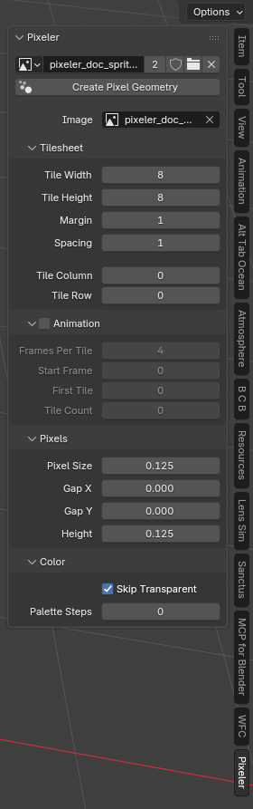

# Pixeler

Pixeler turns an image or a tilesheet sprite into live pixel geometry in Blender 5.0+. It is licensed GPL-3.0-or-later.

## Install

Download `pixeler-0.7.0.zip` from the [latest release](https://github.com/benkl/pixeler/releases/latest). In Blender, open **Edit → Preferences → Get Extensions**, choose **Install from Disk** from the dropdown at the top right, select the zip, and enable the add-on.

## Use

1. Open an image in Blender. In the 3D View sidebar (**N**), open **Pixeler** and choose the image. The folder button can open another image.
2. Click **Create Pixel Geometry**. Pixeler makes one object in the `Pixeler` collection with a Geometry Nodes modifier; no per-pixel objects or materials are created.
3. Select that object. The sidebar shows its live controls in four sub-panels; the Geometry Nodes modifier tab shows the same sections. Hover any control for a tooltip.
   - **Image**: switch the source image; edits to image pixels update the object.
   - **Tilesheet**
     - **Tile Width / Tile Height**: size in pixels of one sprite on a regular tilesheet. `0` uses everything inside the margin on that axis.
     - **Margin / Spacing**: pixels of border around the whole sheet (all four sides) and pixels between neighboring tiles. Tiles are counted from the upper-left corner inside the margin; a partial tile at the far edge is ignored.
     - **Tile Column / Tile Row**: sprite to show, counted from `0`. Selections past the last tile clamp to it. Greyed out while Animation is on.
   - **Animation** (collapsed by default; the checkbox in its header turns it on): ignore Tile Column/Row and flip through tiles in reading order (left to right, then down), using the scene's current frame.
     - **Frames Per Tile**: how many frames each tile is held.
     - **Start Frame**: frame at which the first tile appears. Earlier frames wrap backwards, so the loop is continuous.
     - **First Tile / Tile Count**: index of the first tile in the loop (`0` is the upper-left) and how many tiles to loop through; `0` means through the last tile.
   - **Pixels**
     - **Pixel Size**: width and depth of each plane or cube, in Blender units.
     - **Gap X / Gap Y**: additional spacing between pixels.
     - **Height**: `0` for planes; positive values make cubes resting on the XY plane.
     - **Custom Pixel**: build each pixel from the object's own `Pixeler Pixel Geometry` node group instead of the built-in plane or cube. See below.
   - **Color** (collapsed by default)
     - **Skip Transparent**: remove pixels with zero alpha. Turn it off to keep their geometry; partially transparent pixels retain their alpha.
     - **Palette Steps**: `0` keeps original colors; positive values quantize straight RGB to that many steps between 0 and 1.
     - **Store Vertex Colors**: write `pixeler_color` to the mesh (default on). Off leaves the attribute out, so you can color the mesh yourself.
     - **Object Color**: the object's viewport color (`object.color`). Solid shading set to Object color shows it directly. The `Pixeler Surface` material multiplies it with the pixel color, so white leaves the pixels unchanged. With Store Vertex Colors off the material has no color to read and renders black; give the object your own material or shade it in the viewport.

Pixels are centered around the object's origin; the bottom row of the image maps to negative Y. Pixeler stores `pixeler_color` (unless turned off) and `pixeler_alpha` as geometry attributes and reads them in one shared `Pixeler Surface` material. Adjust that material's Principled BSDF for metalness, roughness, etc. Editing the material affects all Pixeler objects in the file. To edit geometry directly, apply the modifier first. This is a clean cutover: existing objects made by the Blender 2.8 add-on are not converted automatically.

## Custom pixels

Every Pixeler object gets two node groups: `Pixeler Geometry` (the modifier) and `Pixeler Pixel Geometry` (the pixel template). Both are per object, so editing them changes that object only. With **Custom Pixel** on, the modifier runs the pixel group once for each visible pixel in a For Each Element zone and moves the result to that pixel's position.

The pixel group receives `Color`, `Alpha`, `Size`, `Height`, `Column`, `Row` (the pixel's position in the image) and `Store Vertex Colors`. It returns one `Geometry`. The default contents rebuild the plane or cube, so switching Custom Pixel on changes nothing until you edit it. Open the group in the Geometry Nodes editor (select the "Edit this group to shape each pixel" node in the modifier and press **Tab**), then swap in your own mesh, offset by `Column` and `Row`, scale by `Alpha`, and so on. Keep the `pixeler_color` and `pixeler_alpha` stores if the material should still read them.

Objects made by 0.6.0 and earlier keep their old shared node group. The sidebar hides their controls. Click **Create Pixel Geometry** again to get an object with the new layout; the old group is left alone.

Large images produce many faces: roughly one face per visible pixel in plane mode or six in cube mode. Start with small images, especially when extruding. Saved `.blend` files keep the source image data block; pack external images if the file must be portable.

## Development

The add-on is the extension package in `pixeler/`: `__init__.py` plus `blender_manifest.toml`. Build the zip with `blender --command extension build --source-dir pixeler --output-dir dist`; `dist/` is git-ignored. Blender's extensions registry accepts add-ons only under GPL-3.0-or-later, which is why the project uses it from 0.4.0. Versions up to 0.3.0 and the `pre-ai` branch stay MIT.

The `pre-ai` branch preserves the original Blender 2.8 implementation. This release uses Blender 5's typed Geometry Nodes modifier inputs. For local development, `dev/reload_addon.py` reloads `pixeler/__init__.py` in Blender through the Blender MCP `execute_blender_code` tool; its hard-coded path points to this checkout and must be changed on another machine. See `AGENTS.md` for the local test loop.
